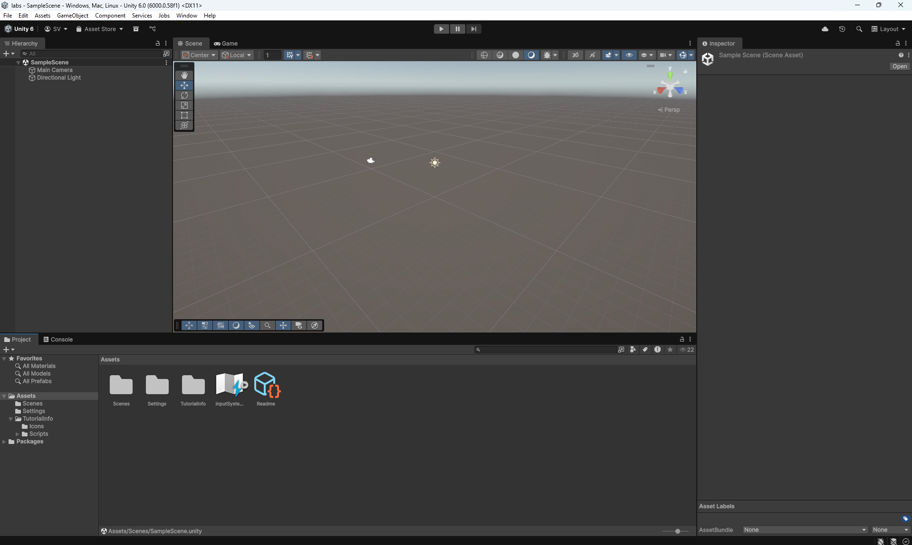
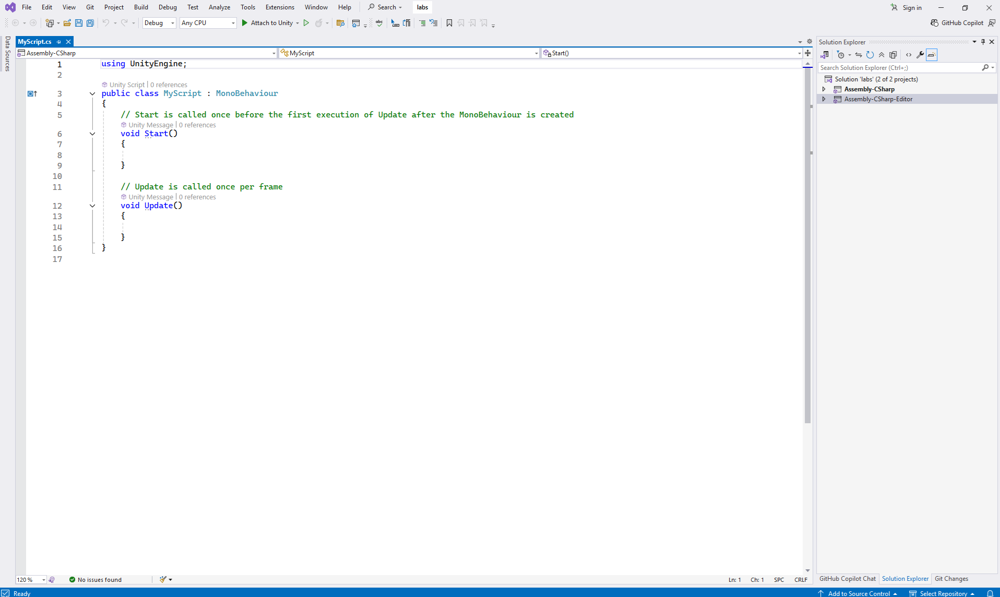

# Μικρομάθημα 0: Προαπαιτούμενα

## Στόχοι Μάθησης
Να δημιουργήσουμε το κατάλληλο περιβάλλον εργασίας για να εκτελούμε τις δραστηριότητες και να λύνουμε τις ασκήσεις 
των μικρομαθημάτων Unity.

---

## Εισαγωγή
Για να εγκαταστήσετε το Unity θα χρειαστείτε:
 - Να δημιουργήσετε **account** στο Unity.
 - Να εγκαταστήσετε το **Unity Hub**. Αυτό είναι το περιβάλλον μέσω του οποίου θα δημιουργείτε νέα Project και θα
   προσθαφαιρείτε ή θα προσθέτετε λειτουργικά στοιχεία στην τρέχουσα εγκατάσταση Unity.
 - Μέσω του Unity Hub να εγκαταστήσετε έναν **Unity Editor**, που είναι το βασικό περιβάλλον εργασίας για τα Project σας.
 - Μέσω του Unity Hub να εγκαταστήσετε το **Visual Studio**, μέσω του οποίου θα γράφετε κώδικα (Scripts σε C#) για τα
   Project σας.

---

## Δημιουργία Λογαριασμού
Για να δημιουργήσετε έναν λογαριασμό στο Unity θα χρειαστεί να συνδεθείτε στον κεντρικό ιστότοπο της εταιρίας unity.com
και να επιλέξετε *Create a Unity ID*. **Προσοχή:** αν δουλεύετε σε παραπάνω από έναν υπολογιστές (π.χ. σπίτι, εργαστήριο, 
laptop) χρησιμοποιήστε το ίδιο Unity ID, ώστε να μπορείτε να έχετε πρόσβαση σε όλα τα στοιχεία του λογαριασμού σας, π.χ.
Projects που έχετε δημιουργήσει, Assets που έχετε κατεβάσει κ.ά.

---

## Λήψη και άδεια Unity Hub
Αφού δημιουργήσετε λογαριασμό, το επόμενο βήμα είναι η λήψη και εγκατάσταση του Unity Hub. Μεταβείτε στη σελίδα 
https://unity.com/download και κατεβάστε το Unity Hub για το λειτουργικό σύστημα του μηχανήματός σας. Αφού το
κατεβάσετε, το εγκαταστήσετε και το τρέξετε, θα σας ζητήσει να συνδεθείτε με το account σας και να δημιουργήσετε μια άδεια. 
Επιλέξτε τη δωρεάν άδεια **Unity Personal (free)** και είστε έτοιμοι να προχωρήσετε στο επόμενο βήμα.

---

## Εγκατάσταση Unity Editor και Visual Studio
Μέσα από το περιβάλλον του Unity Hub επιλέγετε *Installs → Install Editor* και διαλέγετε από τους Official Editors
αυτόν που προτιμάτε. Για να αξιοποιήσετε όλες τις δυνατότητες του Unity χωρίς προβλήματα ασυμβατότητας
στο μέλλον, είναι καλό να επιλέξετε την πιο πρόσφατη κατηγορία εκδόσεων (τη στιγμή που γράφεται αυτό το κείμενο είναι
Unity 6) και από τις διαθέσιμες εκδόσεις αυτή που έχει σήμα **LTS**. Το LTS σημαίνει *Long Term Support*, δηλαδή πρόκειται για
μια σταθερή έκδοση που θα υποστηρίζεται με βελτιώσεις και διορθώσεις σφαλμάτων από την εταιρία.

Τα μικρομαθήματα έχουν δημιουργηθεί σε **Unity Editor v.6000.0.58f2**. Είναι εξαιρετικά απίθανο όμως τα παραδείγματα που
παρουσιάζουμε στα μαθήματα να μη λειτουργούν κανονικά και σε επόμενες εκδόσεις της σειράς 6.

Κατά την εγκατάσταση του Editor το Unity Hub θα σας ρωτήσει και για επιπλέον modules που θέλετε να εγκαταστήσετε. Επειδή κάθε
ένα από αυτά καταλαμβάνει πολύ χώρο στον δίσκο (της τάξης μερικών Gb) είναι καλό να είστε προσεκτικοί με τις επιλογές σας.
Χρειαζόμαστε οπωσδήποτε το **Visual Studio** και πέραν αυτού είναι χρήσιμα:
 - **Android build support** αν θέλουμε να δημιουργούμε εφαρμογές για κινητά τηλέφωνα ή και για standalone μάσκες VR τύπου Oculus Quest,
 - **Windows build support (IL2CPP)** για να δημιουργούμε εκτελέσιμα (αρχεία .exe) για Windows, και
 - **Web build support** αν θέλουμε οι εφαρμογές μας να τρέχουν σε ιστοσελίδες και να εκτελούνται μέσω browser.

---

*Εικόνα 1: Το περιβάλλον του Unity Editor*

## Τελικός έλεγχος
Για να βεβαιωθείτε ότι όλα πήγαν καλά κάντε τους εξής δύο ελέγχους:
 - Δημιουργήστε ένα νέο Project μέσω του Unity Hub επιλέγοντας από τα templates το **Universal 3D** και ανοίξτε το. Θα 
   πρέπει ο Editor να ανοίξει κανονικά και να εμφανιστεί το περιβάλλον εργασίας του Unity (Εικ. 1).
 - Στο Project που μόλις δημιουργήσατε προσθέστε ένα νέο Script (δεξί κλικ στο παράθυρο Project, 
	- *Create -> Scripting -> Monobehaviour Script*). Δώστε του ένα όνομα, π.χ. *MyScript* (**προσοχή:** μόνο λατινικοί χαρακτήρες χωρίς κενά) και κάντε
   διπλό κλικ πάνω του. Θα πρέπει να ανοίξει το Visual Studio και να μπορείτε να δείτε και να επεξεργαστείτε τον κώδικα (Εικ. 2).

Αν δεν πήγε καλά κάτι από τα δύο παραπάνω θα πρέπει να ελέγξετε ξανά την εγκατάσταση. Αν όλα πήγαν καλά, συγχαρητήρια, 
είστε έτοιμοι να ξεκινήσετε τα μαθήματα!

*Εικόνα 2: Ένα νέο Script στο περιβάλλον του Visual Studio*