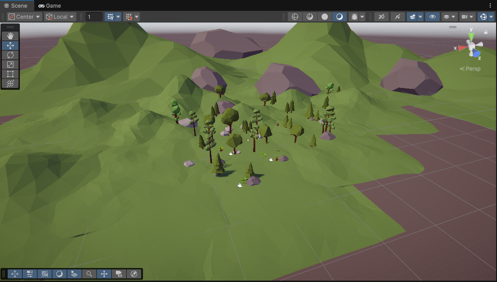
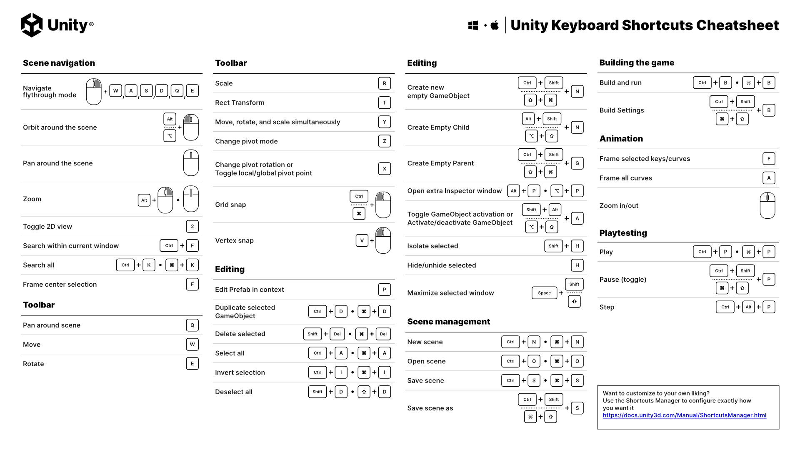

# Μικρομάθημα 1: Unity Editor

## Στόχοι Μάθησης
Να αναγνωρίσουμε τα βασικά τμήματα του Unity Editor και να μπορούμε να πλοηγούμαστε σε αυτόν.

---

## Εισαγωγή
Ο Unity Editor είναι ένα σύνθετο περιβάλλον εργασίας που μας επιτρέπει να αναπτύσσουμε, να εκτελούμε και να 
μεταγλωττίζουμε (*compile*) τα Projects μας. Αποτελείται από διάφορα παράθυρα και, όπως τα περισσότερα
αντίστοιχα περιβάλλοντα εργασίας, μας επιτρέπει να *διαμορφώνουμε τη διάταξή τους (Layout)*. Οι έμπειροι χρήστες
του Unity προσαρμόζουν τα παράθυρα ανάλογα με την τρέχουσα εργασία τους, τις ανάγκες τους και τον αριθμό των
οθονών που χρησιμοποιούν.

Τα βασικά παράθυρα που θα χρειαστεί να γνωρίζετε είναι τα παρακάτω. Η θέση τους στις παρενθέσεις είναι αυτή που έχουν
στο βασικό Layout.
 - Το **Hierarchy** (αριστερά) παρουσιάζει όλα τα αντικείμενα της σκηνής με τα ονόματά τους ως ιεραρχία στοιχείων. Ο λόγος που είναι ιεραρχία και όχι απλή λίστα είναι γιατί η θέση κάποιων αντικειμένων μπορεί να εξαρτάται
   από άλλα. Π.χ. ένα δωμάτιο και τα έπιπλά του.
 - Το **Scene** (κέντρο) παρουσιάζει τη σκηνή με οπτικό τρόπο, όπου φαίνεται η τρισδιάστατη μορφή και τοποθέτηση των
   αντικειμένων. Μπορούμε να πλοηγηθούμε στη σκηνή με τα controls που υπάρχουν πάνω δεξιά στο παράθυρο ή χρησιμοποιώντας πληκτρολόγιο
   και ποντίκι. Μπορούμε επίσης να μετακινήσουμε, να περιστρέψουμε ή να αλλάξουμε την κλίμακα ενός επιλεγμένου αντικειμένου της
   σκηνής με τα εργαλεία που υπάρχουν πάνω αριστερά στο παράθυρο.
 - Το **Game** (κέντρο, δεύτερο tab) δείχνει την πραγματική εκτέλεση της εφαρμογής ή του παιχνιδιού (ονομάζεται *Game* επειδή το Unity δημιουργήθηκε αρχικά ως μηχανή παιχνιδιών, αν και σήμερα χρησιμοποιείται και σε άλλους τομείς). Η απεικόνιση
   του κόσμου γίνεται από τη θέση και τον προσανατολισμό μιας κάμερας που υπάρχει στη σκηνή (αρχικά έχει το όνομα Main Camera).
 - Το **Project** (κάτω) δείχνει όλα τα Assets του Project μας. Τα Assets είναι οργανωμένα σε σύστημα φακέλων με τον ίδιο τρόπο που τα αρχεία είναι καταχωρημένα στο δίσκο μας, κάτω από τον φάκελο του Project.
 - To **Inspector** (δεξιά) δείχνει τις πληροφορίες του επιλεγμένου αντικειμένου, είτε είναι αντικείμενο της σκηνής είτε
   κάποιο Asset που έχουμε επιλέξει από το σχετικό παράθυρο.
 - Το **Console** (κάτω, δεύτερο tab) δείχνει τα μηνύματα του συστήματος και είναι εξαιρετικά χρήσιμο τόσο για να εντοπίσουμε
   τυχόν λάθη στον κώδικά μας όσο και για να εμφανίζουμε debug μηνύματα κατά την εκτέλεση της εφαρμογής μας.

---

### Δραστηριότητα: Εξερεύνηση σκηνής
Δημιουργήστε στο Unity Hub ένα νέο Project τύπου **3D (URP)**. Στη συνέχεια δοκιμάστε να φέρετε μια έτοιμη σκηνή από το 
Asset Store της Unity. Για παράδειγμα την παρακάτω, που δείχνει ένα φυσικό τοπίο με απεικόνιση χαμηλού αριθμού 
πολυγώνων (low poly): 
https://assetstore.unity.com/packages/3d/environments/landscapes/low-poly-simple-nature-pack-162153

Ανοίξτε το Asset Store έχοντας κάνει login με το Unity ID σας, πατήστε *Add to my Assets* και *Open in Unity* και στο παράθυρο που θα
εμφανιστεί επιλέξτε *Download* και μετά *Import to Project* και *Import* όλων των στοιχείων.

Θα παρατηρήσετε ότι δημιουργήθηκε ένας νέος φάκελος στα Assets. Ανοίξτε τον (με διπλό κλικ) και ανοίξτε το αρχείο 
*SimpleNaturePack_2020.3_URP* (με το σήμα του Unity). Αυτό μας φέρνει υλικά κατάλληλα για την προεπιλεγμένη μορφή των Projects
του Unity 6 (URP). Στη συνέχεια ανοίξτε μία από τις δύο σκηνές στον φάκελο *Scenes*. Θα πρέπει να δείτε κάτι σαν την 
παρακάτω εικόνα (Εικ. 1).

*Εικόνα 1: Η σκηνή της συλλογής Low Poly Simple Nature Pack.*

 - Δοκιμάστε να πλοηγηθείτε στη σκηνή. Για να το κάνετε αυτό εξοικειωθείτε με τα πλήκτρα και τις εντολές πλοήγησης (Εικ. 2).
 - Επιλέξτε αντικείμενα και δοκιμάστε να τα μετακινήσετε στη σκηνή.
 - Επιλέξτε την κάμερα και μετακινήστε την. Παρατηρήστε την αλλαγή στην εικόνα του παραθύρου *Game*. Διαμορφώστε το Layout
   του Editor έτσι ώστε να βλέπετε τη σκηνή και το *Game* ταυτόχρονα, για να έχετε άμεση εικόνα του αποτελέσματος των αλλαγών.

*Εικόνα 2: Keyboard shortcuts του Unity Editor.*

## Ανασκόπηση νέων εννοιών μαθήματος
- βασικά παράθυρα του Unity Editor -> Hierarchy, Scene, Game, Project, Inspector, Console
- βασικά πλήκτρα χειρισμού του Editor και της σκηνής