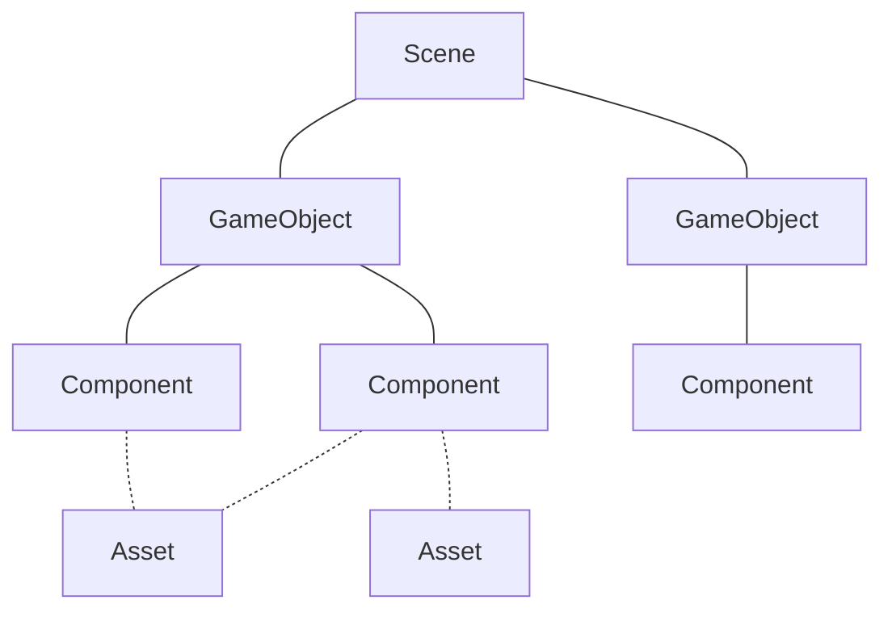

# Μικρομάθημα 2: Τα δομικά στοιχεία του Unity

## Στόχοι Μάθησης
Να κατανοήσουμε την αρχιτεκτονική του Unity: Σκηνές, GameObjects, Components και Assets.

---

## Εισαγωγή
Το Unity βασίζεται σε μια απλή αλλά ισχυρή ιδέα:

- Μια **Σκηνή** είναι σαν τη σκηνή ενός θεάτρου.
- Τα **GameObjects** είναι οι ηθοποιοί και τα αντικείμενα της σκηνής.
- Οι **Components** δίνουν μορφή και συμπεριφορά στα GameObjects.
- Τα **Assets** είναι τα αρχεία στα οποία βασίζονται όλα τα παραπάνω και είναι οργανωμένα σε φακέλους μέσα στο Project.
  Περιλαμβάνουν ήχους, εικόνες, υλικά, 3D μοντέλα, κώδικα (scripts) και άλλα.



---

### Δραστηριότητα 1: Εισαγωγή και επεξεργασία GameObject
Δημιουργήστε στο Unity Hub ένα νέο Project τύπου **3D (URP)**. Προσθέστε ένα αντικείμενο στη σκηνή:
*GameObject → 3D Object → Cube*. Παρατηρήστε την προσθήκη του ως όνομα στην ιεραρχία
(παράθυρο **Hierarchy**) και ως 3D αντικείμενο στη σκηνή (παράθυρο **Scene**). Μπορείτε να του αλλάξετε όνομα κάνοντας κλικ
πάνω στο όνομά του στην ιεραρχία.

Δοκιμάστε να μετακινήσετε τον νέο σας κύβο στη σκηνή με
τα εργαλεία μετατόπισης (translation) του Editor. Αντίστοιχα, προσπαθήστε να τον περιστρέψετε (rotation) ή να του αλλάξετε 
κλίμακα (scale).

Στη συνέχεια, έχοντας επιλεγμένο τον κύβο παρατηρήστε και εντοπίστε τα Components του στο παράθυρο 
**Inspector**. Δοκιμάστε να αλλάξετε τη θέση, την περιστροφή ή το μέγεθός του εισάγοντας αριθμητικές τιμές στον Component
**Transform**.

Τέλος, δοκιμάστε να ενεργοποιήσετε και να απενεργοποιήσετε πρώτα τον Component **MeshRenderer** (tickbox δίπλα) και στη συνέχεια 
ολόκληρο το GameObject. Ποια πιστεύετε ότι είναι η διαφορά;

---

## Δημιουργία και επεξεργασία Assets
Μπορείτε να εισάγετε νέα Assets στο Project σας μεταφέροντας (drag) τα αρχεία σας στον χώρο των **Assets**. Για παράδειγμα
μπορείτε να προσθέσετε:
 - 3D γεωμετρίες αντικειμένων
 - εικόνες που θα χρησιμοποιηθούν ως υφές (textures), στοιχεία του UI ή Sprites
 - animations
 - κώδικα
 - … και πολλά άλλα

**Προσοχή:** Είναι χρήσιμο τα Assets του έργου σας να είναι καλά οργανωμένα σε φακέλους και υποφακέλους για να
εντοπίζονται εύκολα.

---

### Δραστηριότητα 2: Δημιουργία υλικού
Κάντε δεξί κλικ στο παράθυρο των Assets και επιλέξτε *Create → Material* και δώστε ένα εύληπτο όνομα (π.χ. red). Πειραματιστείτε
με τις τιμές των Components του νέου υλικού (όπως φαίνονται στον Inspector) και δώστε το κατάλληλο χρώμα.

Για να το αναθέσετε σε ένα GameObject (π.χ. στον κύβο που κατασκευάσατε στην προηγούμενη δραστηριότητα) θα πρέπει να το
μεταφέρετε (drag) είτε στο ίδιο το αντικείμενο στο παράθυρο της σκηνής, είτε στον Inspector εφόσον το αντικείμενο
υποδοχής είναι ήδη επιλεγμένο. Δοκιμάστε και τις δύο τεχνικές!

---

### Δραστηριότητα 3: Δημιουργία Script και ανάθεση σε GameObject
Ξανά με δεξί κλικ στο παράθυρο των Assets επιλέξτε *Create -> Scripting -> Monobehaviour Script*. Δώστε το όνομα *RotateObject*.

**Προσοχή:** Μην χρησιμοποιείτε Ελληνικά ή κενά στην ονομασία των Scripts.

Κάντε διπλό κλικ στο νέο Script. Θα βρεθείτε στο περιβάλλον του Visual Studio. Αντικαταστήστε τον υπάρχοντα κώδικα με τον
παρακάτω και αποθηκεύστε.

```csharp
using UnityEngine;

public class RotateObject : MonoBehaviour {
    public float speed = 50f;

    void Update() {
        transform.Rotate(Vector3.up * speed * Time.deltaTime);
    }
}
```

Τώρα δοκιμάστε να προσθέσετε το παραπάνω Script ως Component σε ένα αντικείμενο. Εκτελέστε το Project (κουμπί Play)!

Τι παρατηρείτε;

Δοκιμάστε στη συνέχεια, την ώρα που εκτελείται το πρόγραμμα να αλλάξετε την τιμή speed. Η μεταβλητή speed λειτουργεί εδώ ως
**δημόσια μεταβλητή** που είναι προσβάσιμη από τον Editor. Αυτό μας επιτρέπει να προσαρμόζουμε εύκολα τη συμπεριφορά
των αντικειμένων χωρίς να ξανακάνουμε compile.
