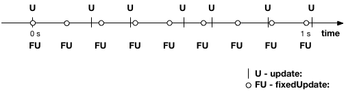

# Μικρομάθημα 4 — Βρόχος Ελέγχου και Γεγονότα

## Ο Βρόχος Ελέγχου
Κάθε περιβάλλον που επιτρέπει διάδραση σε πραγματικό χρόνο λειτουργεί με έναν ατέρμονο **βρόχο ελέγχου (control loop)**.
Εκεί συνήθως διαβάζονται οι τιμές εισόδου, λαμβάνονται κάποιες αποφάσεις, και στέλνεται το αποτέλεσμα στην έξοδο.
Στο Unity είναι λίγο πιο σύνθετα τα πράγματα, καθώς υπάρχουν **δύο παράλληλοι βρόχοι ελέγχου**. 
- **physics loop**, που χειρίζεται την φυσική και το animation, ανανεώνεται σε σταθερό ρυθμό και η βασική του συνάρτηση 
είναι η *FixedUpdate()*
- **game logic loop**, που χειρίζεται την είσοδο του χρήστη και την απεικόνιση της σκηνής, ανανεώνεται στον ταχύτερο δυνατο
ρυθμό (ανάλογα με τους υπολογισμούς που κάνει το πρόγραμμα, τον όγκο γραφικών της σκηνής και τις επιδόσεις της CPU και
GPU) που δεν είναι σταθερός, και η φασική του συνάρτηση είναι η *Update*.

Μπορείτε να δείτε ένα πολύ πιο αναλυτικό, τεχνικό σχήμα των βρόχων και βασικών συμβάντων του Unity [εδώ](https://docs.unity3d.com/6000.2/Documentation/uploads/Main/monobehaviour_flowchart.svg)

Και εδώ ένα πιο απλό διάγραμμα που περιγράφει τη σχέση μετάξύ Update και FixedUpdate στο χρόνο:


Θα έχετε παρατηρήσει ότι η Update() εμφανίζεται σε κάθε νέο MonoBehaviour script που δημιουργείτε, επειδή ακριβώς
είναι η πιο συχνά χρησιμοποιούμενη.


```csharp
void Update() {

}
```

Η Unity λοιπόν καλεί τη συνάρτηση `Update()` αυτόματα πολλές φορές το δευτερόλεπτο (συνήθως 30–120), και εμείς γράφουμε
κώδικα σε αυτήν για να ελέγχουμε είσοδο, να κινούμε αντικείμενα ή να αλλάζουμε με συνεχή τρόπο την κατάσταση της σκηνής.

---

## Συνεχής Κίνηση Αντικειμένου
Κάθε GameObject έχει ένα component με όνομα `Transform` που περιέχει τη θέση, περιστροφή και κλίμακα του αντικειμένου. 
Αυτό το έχουμε εξετάσει και χρησιμοποιήσει ήδη στον Editor σε προηγούμενο μάθημα. Ας δούμε εδώ πώς μπορούμε
να έχουμε πρόβαση στον μετασχηματισμό μέσω κώδικα:

```csharp
transform.Translate(5.0f, 0, 0);
```
Η μεταβλητή `transform` δείχνει στον Transform component του GameObject στο οποίο τρέχει το scrpit. Σε αυτό το αντικείμενο
καλούμε (βλέπε χρήση τελείας '.') την μέθοδο Translate, η οποία το μετατοπίζει κατά 5, 0 και 0 στους 
άξονες x, y και z αντίστοιχα. Οι τιμές που δέχεται η μέθοδος είναι τύπου float. 

### Δραστηριότητα
Δοκιμάστε να προσθέσετε την παραπάνω
εντολή στην Start() ενός νέου script και να το αποδώσετε σε ένα αντικείμενο της σκηνής. Παρατηρήστε το αποτέλεσμα της 
μετατόπισης όταν εκτελείται το πρόγραμμα.

### Παράδειγμα: συνεχής κίνηση προς τα δεξιά

```csharp
public float speed = 1.0f;

void Update() {
    transform.Translate(speed * Time.deltaTime, 0, 0);
}
```

Εδώ η μετατόπιση ελέγχεται από μια μεταβλητή με το ονομα speed. Επιπλέον η `Time.deltaTime` εξασφαλίζει 
**ομαλή κίνηση ανεξάρτητα από το frame rate**. 

Με απλά λόγια, η Time.deltatime είναι η τιμή του χρόνου
που πέρασε από το προηγούμενο καρέ σε αυτό, το Δt. Πολλαπλασιάζοντάς το με μια τιμή ταχύτητας έχουμε
κίνηση σταθερή και ανεξάρτητη του ρυθμού που καλείται η Update().

Δοκιμάστε να αλλάξετε την τιμή του `speed` στον Inspector την ώρα που εκτελείται το πρόγραμμα και δείτε τη διαφορά! 
Μπορείτε να την κάνετε και αρνητική.

---

## Είσοδος πληκτρολογίου
Μπορούμε να κάνουμε το αντικείμενο να κινείται μόνο όταν πατιέται ένα πλήκτρο.  
Η Unity παρέχει τις συναρτήσεις `Input.GetKey()` και `Input.GetKeyDown()`, οι οποίες παίρνουν ως παράμετρο το
όνομα του πλήκτρου και επιστρέφουν true όσο το πλήκτρο πατιέται (GetKey) ή την πρώτη μόνο φορά που θα
πατηθεί (GetKeyDown). Τροποποιήστε τον κώδικά σας ως εξής:

```csharp
void Update() {
    if (Input.GetKey(KeyCode.RightArrow)) {
        transform.Translate(speed * Time.deltaTime, 0, 0);
    }
}
```

Τώρα το αντικείμενο κινείται **μόνο όσο κρατάς πατημένο** το δεξί → βέλος.

Δοκιμάστε και άλλα πλήκτρα, όπως `KeyCode.LeftArrow`, `KeyCode.Space`, `KeyCode.A`.`

---

## Αντίδραση σε συμβάντα (Κλικ Ποντικιού)
Εδώ θα δούμε έναν άλλο τρόπο χειρισμού της εισόδου στο Unity. Όχι μέσω της Update() αλλά μέσω συναρτήσεων που χειρίζονται
συμβάντα (events). Οι συναρτήσεις αυτές καλούνται **μία φορά**, όταν ενεργοποιείται ένα γεγονός (event).  
Η Unity παρέχει πολλές τέτοιες *event functions*, π.χ.:

```csharp
void OnMouseDown() {
    Debug.Log("The object has been clicked!");
}
```

Αυτό εκτελείται αυτόματα όταν κάνεις κλικ πάνω στο αντικείμενο στο οποίο τρέχει το script.

**Προσοχή:** για να λειτουργήσει η OnMouseDown θα πρέπει το αντικείμενο να έχει έναν ειδικό component, τον Collider, 
για τον οποίο μιλάμε σε επόμενο μάθημα. Όλα τα βασικά στερεά του Unity (π.χ. κύβος, σφαίρα, κλπ) έχουν ήδη Collider
άρα ο κώδικας θα λειτουργήσει σωστά για αυτά.

---

## Συνδυασμός βρόχου ελέγχου και συμβάντων
Ας ενώσουμε τα παραπάνω σε ένα script που τα συνδυάζει:

```csharp
public class MovingObject : MonoBehaviour {
    public float speed = 1.0f;
    private int direction = 1;

    void Update() {
        transform.Translate(direction * speed * Time.deltaTime, 0, 0);
    }

    void OnMouseDown() {
        direction = -direction;
        Debug.Log("changing direction..");
    }
}
```

Όπως βλέπετε, το συμβάν άλλαξε την τιμή μιας μεταβλητής, η οποία χρησιμοποιείται από την Update. Έτσι το αντικείμενο 
κινείται συνεχώς προς μία κατεύθυνση, αλλά κάθε φορά που πατούμε το ποντίκι πάνω του η κατεύθυνση αλλάζει
και εμφανίζεται σχετικό μήνυμα.

---

## Άσκηση
Δημιουργήστε ένα script στο οποίο ένα αντικείμενο κινείται με σταθερή ταχύτητα (που μπορεί να προσαρμόζεται στον Editor)
προς τα δεξιά. Με click στο ποντίκι αλλάζει η διεύθυνση κίνησης (αριστερά ή δεξιά), με πάτημα του πάνω βέλους ανεβαίνει
ψηλότερα κατά μία μονάδα και συνεχίζει την κίνησή του εκεί και με το κάτω βέλος κατεβαίνει κατά μία μονάδα, αντίστοιχα.

---

## Ανασκόπηση νέων εννοιών μαθήματος
- Δύο βρόχοι ελέγχου στο Unity, φυσικής και λογικής παιχνιδιού
- `Update()` → συνεχής βρόχος ελέγχου λογικής παιχνιδιού 
- `Transform.Translate()` → μετακινεί το αντικείμενο
- `Time.deltatime` -> ο χρόνος που μεσολάβησε από το προηγούμενο frame, πολλαπλασιάζεται με την ταχύτητα για ομαλή 
κίνηση ανεξάρτη τη των frames per second.
- `Input.GetKey()` → έλεγχος πληκτρολογίου  
- `OnMouseDown()` → συμβάν (event) από ποντίκι  
- Συνδυάζοντάς τα δημιουργήσαμε **διαδραστική και δυναμική συμπεριφορά**
