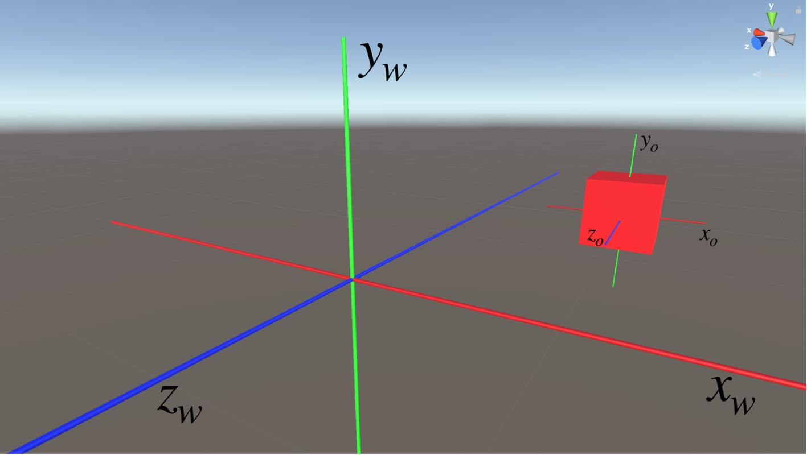

# Μικρομάθημα 5: Μετασχηματισμοί

## Στόχοι
- Να κατανοήσετε πώς μπορείτε να αλλάζετε τη θέση, την περιστροφή και την κλίμακα ενός GameObject μέσω script.  
- Να γνωρίσετε τα βασικά για τα **διανύσματα (Vectors)** τα **Quaternions** και τις **γωνίες Euler**. 

---

## Πρόσβαση στον μετασχηματισμό

Όπως έχουμε δει στον Editor, κάθε **GameObject** στο Unity έχει έναν component με όνομα **Transform**, ο οποίος περιγράφει:
- **position**: τη θέση του αντικειμένου,
- **rotation**: την περιστροφή του,
- **scale**: την κλίμακα.

Μπορούμε να προσπελάσουμε και να τροποποιήσουμε αυτές τις ιδιότητες μέσα από script:

```csharp
transform.position = new Vector3(0, 1, 0);
transform.rotation = Quaternion.Euler(0, 90, 0);
transform.localScale = new Vector3(2, 2, 2);
```
Στον παραπάνο κώδικα προσπελάσαμε τη θέση, την περιστροφή και την κλίμακα του αντικειμένου μέσα από τα πεδία: 
*transform.position*, *transform.rotation* και *transform.localScale* αντίστοιχα. 

Στο πεδίο position δώσαμε 3 τιμές που μεταφράζονται ως η νέα θέση στους άξονες Χ, Υ και Ζ αντίστοιχα. Στο σύστημα συντεταγμένων
του Unity το Υ είναι το ύψος και το Ζ το βάθος. Οι τιμές εκφράζονται σε "μονάδες κόσμου", αλλά συστήνεται να γίνεται
η αντιστοιχία 1 μονάδα κόσμου = 1 μέτρο.

Στο πεδίο rotation δώσαμε επίσης 3 τιμές που είναι οι τρεις περιστροφές γύρω από τους άξονες X, Y και Ζ αντίστοιχα, εκφρασμένες
σε μοίρες. Αυτός είναι ένας από τους τρόπους που μπορούμε να περιγράψουμε 3Δ περιστροφές και ονομάζεται γωνίες Euler.

Τέλος, στο πεδίο localScale οι 3 τιμές εκφράζουν τον βαθμό αυξομείωσης του μεγέθους του αντικειμένου στους άξονες X, Υ και Ζ
αντίστοιχα. Στο συγκεκριμένο παράδειγμα διπλασιάζεται. Αν οι τρεις τιμές δεν είναι ίδιες (non-uniform scale) τότε το αντικείμενο
παραμορφώνεται.

**Προσοχή**: θα παρατηρήσατε ότι στην κλίμακα υπάρχει η λέξη 'local' μπροστά. Αυτό συμβαίνει γιατί αλλάζουμε την "τοπική" κλίμακα
του αντικειμένου, όχι την συνολική (που μπορεί να επηρεάζεται από αντικείμενα πάνω από αυτό στην ιεραρχία). Αν θέλουμε το
ίδιο για την θέση και την περιστροφή μπορούμε να χρησιμοποιήσουμε τα πεδία *localPosition* και *localRotation* αντίστοιχα!

---

## Διανύσματα (Vectors)

Τα **διανύσματα** είναι αντικείμενα που περιγράφουν μια **κατεύθυνση** και ένα **μέγεθος**.  
Στη Unity χρησιμοποιούνται συχνά οι κλάσεις **Vector2** (2D) και **Vector3** (3D) και περιγράφουν θέσεις, μετατοπίσεις
ή και γωνίες, ανάλογα με τη χρήση.

Παράδειγμα:
```csharp
Vector3 move = new Vector3(1, 0, 0); // μετακίνηση προς τον άξονα Χ
transform.position += move;
```
Ορίζαμε ένα νέο διάνυσμα μετακίνησης και το προσθέσαμε στην υπάρχουσα θέση του αντικειμένου. Είναι το αντίστοιχο του
transform.Translate που είδαμε σε προηγούμενο μάθημα.

Παρατηρήστε τον τρόπο με τον οποίο δηλώνονται και αρχικοποιούνται οι μεταβλητές τύπου Vector (με την κλήση της εντολής new). 
Αυτός είναι ο τρόπος που χρησιμοποιείται γενικότερα στη C# όταν ο τύπος δεδομένων είναι αντικείμενο κάποιας 
κλάσης (όπως το Vector3) και όχι βασικός τύπος (όπως int, float, bool).

Παρατηρήστε επίσης ότι το += εδώ αναφέρεται σε πρόσθεση διανυσμάτων και όχι πρόσθεση αριθμών! Πράγματι, μπορούμε να κάνουμε
προσθαφαίρεση διανυσμάτων, πολλαπλασιασμό με αριθμό, εσωτερικό και εξωτερικό γινόμενο.

Έτοιμα διανύσματα που μποροούν να χρησιμοποιηθούν απευθείας σε scripts:
- `Vector3.zero` → (0, 0, 0)
- `Vector3.up` → (0, 1, 0)
- `Vector3.forward` → (0, 0, 1)
- `Vector3.right` → (1, 0, 0)

---

## Περιστροφές (Rotations)

Η περιστροφή ενός αντικειμένου εκφράζεται εσωτερικά στο Unity (όπως και στα περισσότερα 3Δ συστήματα) με **Quaternions**,
μια περίπλοκη μαθηματική δομή, δύσκολη στη χρήση. Ένας πιο απλός τρόπος ανάθεσης και ανάγνωστης τιμών είναι οι γωνίες Euler ή 
**Euler Angles**. Οι τιμές όπως είδαμε πιο πάνω περιφράφονται σε μοίρες.

```csharp
transform.rotation = Quaternion.Euler(0, 45, 0);
```

Για συνεχή περιστροφή μέσα στη `Update()`:
```csharp
void Update()
{
    transform.Rotate(0, 30 * Time.deltaTime, 0);
}
```

Όπως παρατηρούμε, η Rotate() είναι η αντίστοιχη της Translate() που είδαμε στο προηγούμενο μάθημα, για σχετικές
περιστροφές, και μπορεί να δεχτεί γωνίες Euler ως παραμέτρους.

---



## Παράδειγμα 1: Κίνηση και Περιστροφή ενός Κύβου

1. Δημιουργήστε ένα νέο **Cube** στη σκηνή.  
2. Προσθέστε ένα script `MoveAndRotate.cs` με τον εξής κώδικα:

```csharp
using UnityEngine;

public class MoveAndRotate : MonoBehaviour {
    public float moveSpeed = 2f;
    public float rotateSpeed = 45f;

    void Update() {
        // Κίνηση προς τα εμπρός
        transform.Translate(Vector3.forward * moveSpeed * Time.deltaTime);

        // Περιστροφή γύρω από τον άξονα Υ
        transform.Rotate(0, rotateSpeed * Time.deltaTime, 0);
    }
}
```

3. Αναθέστε το στον κύβο και πατήστε **Play**.  
Ο κύβος κινείται και περιστρέφεται συνεχώς. Οι τιμές όπως έχουμε δείξει σε προηγούμενο μάθημα
μπορούν να αλλάζουν μέσω του Editor.

Προσοχή: η κίνηση του κύβου γίνεται στο τοπικό σύστημα συντεταγμένων. Γι αυτό και παρότι του λέμε να
μετακινηθεί στον άξονα Ζ (βλ. δήλωση transform.Translate), αυτός αλλάζει διαρκώς διεύθυνση. Μετακινείται
στον τοπικό άξονα Ζ που αλλάζει όσο περιστρέφεται (δηλαδή διαρκώς). Για να μετακινηθεί στον σφαιρικό
άξονα δοκιμάστε να προσθέσετε μια ακόμα παράμετρο στην Translate, το Space.World. Δηλαδή η γραμμή θα 
γίνει:

```csharp
transform.Translate(Vector3.forward * moveSpeed * Time.deltaTime, Space.World);
```
Εκτελέστε και δείτε τη διαφορά!

---

## Παράδειγμα 2: Χειρισμός με Πληκτρολόγιο

Μπορούμε να διαβάζουμε τις τιμές των πλήκτρων αριστερά-δεξιά (ή A-D) και πάνω-κάτω (ή W-S) μέσω των κλήσεων
Input.GetAxis("Vertical") και Input.GetAxis("Horizontal") αντίστοιχα. Οι τιμές έρχονται από το Input System του Unity και
είναι στο διάστημα [-1,1]. 

Σε κάθε έναν από τους δύο άξονες (οριζόντιο και κάθετο), αν δεν πατιέται κανένα πλήκτρο, η τιμή είναι μηδέν, αν πατιέται
το αρνητικό πλήκτρο (κάτω ή αριστερά) η τιμή γίνεται -1 και για το θετικό γίνεται 1. Επομένως, πολλαπλασιάζοντας την τιμή
αυτή με την κίνηση ελέγχουμε τόσο αν θα κινηθεί το αντικείμενο ή όχι, όσο και προς ποια διεύθυνση!

```csharp
void Update() {
    float move = Input.GetAxis("Vertical");
    float turn = Input.GetAxis("Horizontal");

    transform.Translate(Vector3.forward * move * moveSpeed * Time.deltaTime);
    transform.Rotate(0, turn * rotateSpeed * Time.deltaTime, 0);
}
```

Τώρα μπορούμε να κινήσουμε τον κύβο με τα βελάκια ⬆️⬇️⬅️➡️.

---

## Άσκηση

Δημιουργήστε μια **σφαίρα** που:
1. Κινείται συνεχώς δεξιά με συγκεκριμένη ταχύτητα.  
2. Όταν βγεί εκτός κάποιου δεξιού ορίου αλλάζει αυτόματα διεύθυνση
1. Αντίστοιχα όταν βγει εκτός κάποιου αριστερού ορίου
1. Αν πατηθεί το S σταματάει να κινείται και επιστρέφει στο σημείο από το οποίο ξεκίνησε
1. Αν πατηθεί το P ξεκινάει ξανά να κινείται

Χρησιμοποιήστε **public variables** για την ταχύτητα κίνησης και τα όρια.

---

## Ανασκόπηση νέων εννοιών μαθήματος

- Με `transform.position`, `transform.rotation` και `transform.localScale` ορίζουμε απευθείας 
τιμές θέσης, περιστροφής και κλίμακας.  
- Τα διανύσματα **Vector3** χρησιμοποιούνται συχνά στο Unity και εκφράζουν θέση, μετατόπιση, περιστροφή, κλίμακα, κ.α..  
- Οι περιστροφές περιγράφονται με **Quaternions** τα οποία είναι δύσκολα στη χρήση. Προτιμούνται οι **Euler Angles** 
που είναι εύχρηστες για απλές περιστροφές - εκφράζονται σε μοίρες. 
- Μπορούμε να διαβάσουμε τις τιμές των πλήκτρων αριστερά-δεξιά και πάνω-κάτω ως άξονες με τιμές στο [-1,1] μέσω των
`Input.GetAxis("Vertical")` και `Input.GetAxis("Horizontal")` αντίστοιχα.

