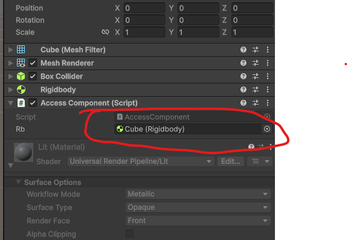

# Μικρομάθημα 6: Πρόσβαση σε Components και GameObjects

## Στόχοι
 
- Να μάθουμε τρόπους πρόσβασης μέσω scripting σε λειτουργικά τμήματα (Components) του GameObject μας
- Να γνωρίσουμε βασικούς Components και τρόπους πρόκλησης αλλαγών σε αυτούς
- Να εξερευνήσουμε τρόπους πρόσβασης σε άλλα GameObjects της σκηνής, και κατ' επέκταση στους δικούς τους
components

---

## Τι είναι τα Components;
Κάθε `GameObject` στην Unity αποτελείται από «τμήματα» (components) που δίνουν συμπεριφορά ή/και 
εμφάνιση: `Transform`, `Renderer`, `Collider`, `Rigidbody`, `AudioSource`, κ.ά.  
Ένα `MonoBehaviour` script, δηλ. ένα script που τρέχει σε ένα GameObject αλληλεπιδρά με άλλα 
components μέσω μεθόδων όπως `GetComponent<T>()`, `TryGetComponent<T>(out T)`, `GetComponentInChildren<T>()`, 
`GetComponentInParent<T>()`, ή μέσω αναφορών που ορίζουμε στο Inspector του Unity Editor.

Θα εξετάσουμε την πρώτη (GetComponent) και την τελευταία (αναφορά στον Inspector) περίπτωση. Αρχικά
θα δούμε πώς μπορούμε να έχουμε πρόσβαση σε Components του GameObject στο οποίο τρέχει το script.

---

## Πρόσβαση σε Components μέσω script

### Χρήση της μεθόδου GetComponent()
Καλώντας τη μέθοδο GetComponent() μας επιστρέφεται ως αντικείμενο ο Component που ζητήσαμε, αν
φυσικά υπάρχει. Αν δεν υπάρχει θα επιστραφεί null. Η σύνταξη μπορεί να φανεί κάπως.. παράξενη για όσους
δεν έχουν εμπειρία σε αντικειμενοστραφή προγραμματισμό, καθώς χρησιμοποιεί **Templates**. Μην σας ανησυχεί
όμως, γιατί αυτή είναι μάλλον και η μοναδική φορά που θα χρησιμοποιήσουμε Templates στην C# για Unity
επομένως μπορούμε απλά να μάθουμε τη σωστή σύνταξη χωρίς να προβληματιστούμε παραπάνω για τη
σημασιολογία.

Ο τρόπος γραφής λοιπόν είναι GetComponent<*Όνομα Component*>(), όπου δίνουμε το όνομα της κλάσης
στην οποία ανήκει το αντικείμενο του Component που ζητούμε, δηλαδή πρακτικά την "κατηγορία" του 
Component, όπως περίπου φαίνεται και στον Inspector. Αν για παράδειγμα θέλουμε πρόσβαση στον 
Component που χειρίζεται τη φυσική (Rigidbody), θα γράψουμε `Rigidbody rb = GetComponent<Rigidbody>()`,
δηλαδή καλούμε την GetComponent με την κλάση Rigidbody ως Template και αποθηκεύουμε το αποτέλεσμα
σε μια μεταβλητή τύπου Rigidbody.

Μοναδική εξαίρεση ο μετασχηματισμός, όπου αντί για `GetComponent<Transform>()` μπορούμε να 
γράψουμε κατευθείαν `transform` όπως είδαμε και στο προηγούμενο μάθημα!

Αν χρειάζεται να αναφερόμαστε συχνά στον component στη διάρκεια εκτέλεσης του script μας είναι καλύτερα
να καλούμε τη GetComponent μια φορά στην αρχή και να αποθηκεύουμε το αντικείμενο σε μια 
*σφαιρική μεταβλητή*. Αυτό μπορούμε να το κάνουμε στη μέθοδο `Start()` που έχουμε γνωρίσει ήδη,
αλλά συστήνεται να γίνεται σε μια άλλη μέθοδο, την `Awake()` που καλείται πριν από οποιαδήποτε
Start όλων των scripts και διασφαλίζει ότι η μεταβλητή θα έχει πάρει τιμή πριν ξεκινήσουν να 
εκτελούνται τα scripts που μπορεί να ζητήσουν πρόσβαση σε αυτή (π.χ. από άλλα GameObjects).

Ας δούμε ένα παράδειγμα. Δημιουργήστε μια νέα σκηνή, προσθέστε έναν κύβο σε θέση που να είναι 
εμφανής στην κάμερα (π.χ. στην αρχή των αξόνων), και σε αυτόν προσθέστε
από τον Inspector έναν Component **Rigidbody** (προσοχή, όχι Rigidbody 2D). Μετά προσθέστε του
το παρακάτω Script (με όνομα AccessComponent).

```csharp
using UnityEngine;

public class AccessComponent : MonoBehaviour {

    Rigidbody rb;

    void Awake() {
        rb = GetComponent<Rigidbody>();
        rb.isKinematic = true;
    }

    void Update() {
        if (Input.GetKeyDown(KeyCode.A)) {
            rb.isKinematic = false;
        }
    }
}
```
Αν εκτελέσετε το πρόγραμμα δεν θα δείτε κάποια κίνηση. Αν όμως όσο το πρόγραμμα εκτελείται πατήσετε
το πλήκτρο Α, ο κύβος θα κάνει ελεύθερη πτώση. Αυτό συνέβη γιατί του προσθέσαμε τον Component Rigidbody
που τον κάνει να αποκτά φυσικές ιδιότητες και να συμπεριφέρεται ως συμπαγές άκαμπτο αντικείμενο.

Στην αρχή του Script (Awake) αποθηκεύσαμε το αντικείμενο του Rigidbody Component στη μεταβλητή rb
και στη συνέχεια, μέσω της isKinematic = true κάναμε το αντικείμενο κινηματικό (αναστέλλονται οι
νόμοι της φυσικής). Στην Update ελέγχουμε για το πάτημα του πλήκτρου A και εφόσον πατηθεί ο κύβος
μας παύει να είναι κινηματικός (isKinematic = false), οπότε οι φυσικοί νόμοι ασκούνται κανονικά
και πέφτει με τη βαρύτητα.

**Προσοχή:** η μεταβλητή isKinematic αφορά μόνο τους Rigidbody components και για να μπορέσουμε να την
αλλάξουμε θα πρέπει να έχουμε πρόσβαση σε ένα αντικείμενο τύπου Rigidbody, όπως το rb του παραδείγματός
μας.

### Με δημόσια αναφορά
Ένας εναλλακτικός τρόπος να αποκτήσετε δημόσια πρόσβαση σε έναν Component είναι μέσω δημόσιας μεταβλητής.
Θα θυμάστε ότι οι δημόσιες μεταβλητές που περιέχουν βασικούς τύπους δεδομένων (int, float, bool, κλπ)
εμφανίζονται στον Editor και μπορείτε να τις αλλάξετε. Το ίδιο ισχύει και με μεταβλητές που περιέχουν
αντικείμενα!

Δοκιμάστε να αλλάξετε τον παραπάνω κώδικα ως εξής:

```csharp
using UnityEngine;

public class AccessComponent : MonoBehaviour {

    public Rigidbody rb;

    void Awake() {
        rb.isKinematic = true;
    }

    void Update() {
        if (Input.GetKeyDown(KeyCode.A)) {
            rb.isKinematic = false;
        }
    }
}
```
Παρατηρείτε ότι η rb έγινε public και σβήστηκε η εντολή GetComponent. Τώρα λοιπόν η rb έχει τιμή
null, εφόσον δεν της έχουμε αναθέσει κάποια τιμή. Όμως, μπορούμε να της αναθέσουμε αντικείμενο
στον Editor! Αν κάνετε compile επιλέξετε στον Editor τον κύβο, πριν τρέξετε το πρόγραμμα φυσικά,
θα δείτε μια δημόσια μεταβλητή rb τύπου Rigidbody η οποία έχει την τιμή None. Αν σύρετε τον Κύβο
από το παράθυρο Hierarchy στο πεδίο τιμής της μεταβλητής rb (εκεί που έγραφε None) θα ανατεθεί
το σωστό αντικείμενο στην rb, δηλαδή ο Component Rigidbody του κύβου σας. Αν τρέξετε το πρόγραμμα
θα έχει ακριβώς την ίδια συμπεριφορά!



Το πιο ενδιαφέρον σημείο όμως είναι το εξής. Μπορείτε αντί για τον κύβο **να κάνετε drag και οποιοδήποτε
άλλο GameObject της σκηνής, αρκεί να έχει Rigidbody Component**. Προσθέστε για παράδειγμα μια νέα
σφαίρα στη σκηνή, προσθέστε της Rigidbody component και δοκιμάστε το!

## Ενεργοποίηση / απενεργοποίηση ενός Component
Οι περισσότεροι από τους Components έχουν την ιδιότητα enabled, η οποία εκφράζει αν είναι ενεργός
ή όχι. Αυτό φαίνεται και στον Inspector με ένα tick που υπάρχει δίπλα στο όνομα του Component.
**Προσοχή:** o Rigidbody αποτελεί εξαίρεση και αν θέλουμε να τον απενεργοποιήσουμε θα το κάνουμε
μέσω της isKinematic όπως πιο πάνω.

Αν λοιπόν θέλουμε ένας Component να σταματήσει να λειτουργεί στη διάρκεια της εκτέλεσης, θα
χρησιμοποιήσουμε την εντολή `enabled = true;` για την μεταβλητή που δείχνει στον component. Για 
παράδειγμα ο παρακάτω κώδικας εμφανίζει ή εξαφανίζει ένα αντικείμενο με το πλήκτρο Β αλλάζοντας
την τιμή του enabled στον Component Renderer που είναι υπεύθυνος για την γραφική απεικόνιση
του αντικειμένου. Προσοχή! το αντικείμενο εξακολουθεί και υπάρχει στη σκηνή και οι υπόλοιποι
Components εκτελούνται κανονικά!

```csharp
public class ToggleRenderDemo : MonoBehaviour {
    private Renderer rend;

    void Awake() {
        rend = GetComponent<Renderer>();
    }

    void Update() {
        if (Input.GetKeyDown(KeyCode.H) && rend != null) {
            rend.enabled = !rend.enabled; // κρύψε/εμφάνισε
        }
    }
}
```

---

## Πρόσβαση σε άλλα GameObjects
Σε πολλές περιπτώσεις θέλουμε από ένα Script να ελέγξουμε τους Components ενός άλλου GameObject και όχι
αυτού στο οποίο τρέχει το Script.

Είδαμε ήδη πιο πάνω έναν τρόπο, μέσω δημόσιας μεταβλητής και ανάθεσης αντικειμένου στον Inspector.
Την ίδια ακριβώς τεχνική μπορούμε να χρησιμοποιήσουμε για να έχουμε πρόσβαση σε ολόκληρο το GameObject
και όχι μόνο σε μεμονωμένο Component. Αυτό θα μπορούσε να είναι χρήσιμο αν π.χ. θέλουμε να επέμβουμε
στη λειτουργία παραπάνω του ενός Components, όπως ο μετασχηματισμός (Transform) και το Rigidbody.
Σε αυτή την περίπτωση θα χρησιμοποιούσαμε **δημόσια μεταβλητή σε GameObject** και θα αναφερόμασταν
σε μεμονωμένα Components αυτού μέσω της GetComponent().

Για παράδειγμα στον παρακάτω κώδικα αποκτούμε πρόσβαση σε ένα GameObject (μέσω του Inspector) και
αν πατηθεί το πλήκτρο C το φέρνουμε στην αρχή των αξόνων και απενεργοποιούμε τη φυσική συμπεριφορά του!

```csharp
using UnityEngine;

public class ResetObject : MonoBehaviour {

    public GameObject otherObject;

    void Update() {
        if(Input.GetKeyDown(KeyCode.C)) {
            otherObject.transform.position = Vector3.zero;
            otherObject.GetComponent<Rigidbody>().isKinematic = true;
        }
    }
}
```
Δοκιμάστε να προσθέσετε το script αυτό σε ένα νέο αντικείμενο της σκηνής σας και να συνδέσετε το
otherObject με τον κύβο σας. Αν τρέξετε το πρόγραμμα και ο κύβος σας πέσει με ελεύθερη πτώση 
(πλήκτρο Α) μπορείτε να τον επαναφέρετε στην αρχική κατάσταση με το C, λόγω του παραπάνω script.

Ένας άλλος τρόπος να έχετε πρόσβαση σε άλλα GameObjects είναι μέσω της `GameObject.Find()`. 
Αυτή είναι μια μέθοδος που καλούμε στην κλάση
GameObject και μας επιτρέπει να βρούμε ένα αντικείμενο της σκηνής με το όνομα που θα του δώσουμε.
Το όνομα είναι case sensitive, άρα πρέπει να γράψουμε σωστά τα κεφαλαία και μικρά γράμματα, όπως
ακριβώς είναι δηλωμένο στη σκηνή!

Αν λοιπόν θέλαμε το παραπάνω script να εφαρμόζεται στο αντικείμενο της σκηνής με το όνομα
"Cube" χωρίς να χρειαστεί να το αναθέσουμε χειροκίνητα στον Editor θα προσθέταμε το παρακάτω:

```csharp
    void Awake() {
        otherObject = GameObject.Find("Cube");    
    }
```
---
## Συχνές χρήσεις των Components
Σχεδόν όλα όσα θέλουμε να κάνουμε σε μια εφαρμογή την ώρα της εκτέλεσης το κάνουμε μέσω των Components.
Για παράδειγμα:
- αλλάζουμε θέση, περιστροφή και μέγεθος σε αντικείμενε μέσω του Transform
- ενεργοποιούμε φυσικές ιδιότητες, ασκούμε δυνάμεις, αλλάζουμε ταχύτητα μέσω του Rigidbody
- εμφανίζουμε ή εξαφανίζουμε αντικείμενα, αλλάζουμε το υλικό, το χρώμα, τη διαφάνεια μέσω
του Renderer
- αλλάζουμε εικόνες μέσω του SpriteRenderer
- ενεργοποιούμε προκαθορισμένες συνθετικές κινήσεις μέσω του Animator
- παίζουμε ή αλλάζουμε ήχους μέσω του AudioSource

Στον παρακάτω πίνακα παρουσιάζονται ορισμένοι βασικοί components με παραδείγματα χρήσης.

|Component|Χρήση|Παράδειγμα|
|---------|-----|----------|
|Transform|μετακίνηση, περιστροφή ή αλλαγή μεγέθους|`transform.Translate(10,0,0);`|
|Rigidbody|ενεργοποίηση φυσικής, άσκηση δύναμης, αλλαγή ταχύτητας|`GetComponent<Rigidbody>().velocity = new Vector3(0,10,0);`|
|Renderer|εμφάνιση/εξαφάνιση αντικειμένων, αλλαγή υλικού, χρώματος ή διαφάνειας|`GetComponent<Renderer>().material.SetColor("_BaseColor", Color.blue)`;|
|SpriteRenderer|αλλαγή εικόνας|`public Sprite s1; ... GetComponent<SpriteRenderer>().sprite = s1;`|
|Animator|εκτέλεση προκαθορισμένου animation|`GetComponent<Animator>().Play("run");`|
|AudioSource|αλλαγή ή εκτέλεση audio clip|`GetComponent<AudioSource>().Play();`|

Τέλος, **κάθε Monobehaviour Script που ανατίθεται σε ένα GameObject λειτουργεί κι αυτό ως Component**.
Έτσι, μπορείτε από το GameObject Α να έχετε πρόσβαση σε Script που τρέχει στο GameObject B και να
αλλάζετε τιμές των δημόσιων μεταβλητών του ή να έχετε πρόσβαση στις δημόσιες μεθόδους του.

Παράδειγμα:

Προσθέστε σε ένα αντικείμενο, έστω κύβο, το παρακάτω Script:

```csharp
using UnityEngine;

public class MovementControl : MonoBehaviour {
    public void Move(string direction) {
        if(direction =="right") {
            transform.Translate(1, 0, 0);
        }
        else if (direction == "left") {
            transform.Translate(-1, 0, 0);
        }
        else if (direction == "up") {
            transform.Translate(0, 1, 0);
        }
        else if (direction == "down") {
            transform.Translate(0, -1, 0);
        }
    }
}
```

Όπως βλέπετε περιλαμβάνει τη δημόσια μέθοδο Move, η οποία ανάλογα με την διεύθυνση που έρχεται ως
παράμετρος σε μορφή string {right, left, up, down} μετακινείται στην αντίστοιχη διεύθυνση. Για το
συγκεκριμένο αντικείμενο το MovementControl είναι ένας Component στον οποίο μπορούν να έχουν 
πρόσβαση άλλα αντικείμενα.

Έτσι, μπορούμε να δημιουργήσουμε ένα δεύτερο αντικείμενο, έστω σφαίρα (σε κάθε περίπτωση θα
πρέπει να έχει collider), το οποίο θα κινεί τον κύβο δεξιά κάθε φορά που κάνουμε κλικ πάνω του.
Το script θα είναι το παρακάτω, και βεβαίως θα πρέπει να συνδεθεί η δημόσια μεταβλητή mc με το
MovementControl του κύβου πριν το τρέξουμε:

```csharp
using UnityEngine;

public class ButtonToMove : MonoBehaviour {
    public MovementControl mc;

    private void OnMouseDown() {
        mc.Move("right");
    }
}
```
---

## Άσκηση
Δημιουργήστε τρία αντικείμενα, ένα πράσινο, ένα κόκκινο κι ένα μπλε που λειτουργούν ως πλήκτρα.
Προσθέστε ένα τέταρτο, μεγαλύτερο αντικείμενο στο κέντρο της σκηνής, του οποίου το χρώμα αλλάζει
ανάλογα με το πλήκτρο που πατήθηκε!

Μπορείτε να βρείτε λύση με δύο μόνο Scripts;

---
## Ανασκόπηση νέων εννοιών μαθήματος
- η συνάρτηση Awake() καλείται μια φορά, πριν τη Start() και χρησιμοποιείται για να αρχικοποιήσουμε
μεταβλητές, όπως π.χ. αυτές που δείχνουν σε Components.
- μπορούμε να έχουμε πρόσβαση σε Components μέσω της συνάρτησης `GetComponent<ComponentName>()` ή
μέσω δημόσιων μεταβλητών και ανάθεσης στον Inspector.
- η πρόσβαση σε άλλα GameObjects γίνεται επίσης μέσω δημόσιων μεταβλητών ή μέσω της `GameObject.Find()`
- τα MonoBehaviour Scripts λειτουργούν κι αυτά ως Components και μπορούμε να έχουμε προσβαση στις
δημόσιες μεταβλητές και μεθόδους τους
- μέσω των Components μπορούμε να προκαλούμε αλλαγές στη σκηνή, όπως να μετακινούμε αντικείμενα, να
ενεργοποιούμε ή μεταβάλλουμε φυσικές ιδιότητες, να παίζουμε ήχους, να αλλάζουμε animations, να εμφανίζουμε
ή εξαφανίζουμε αντικείμενα, κ.α. 

