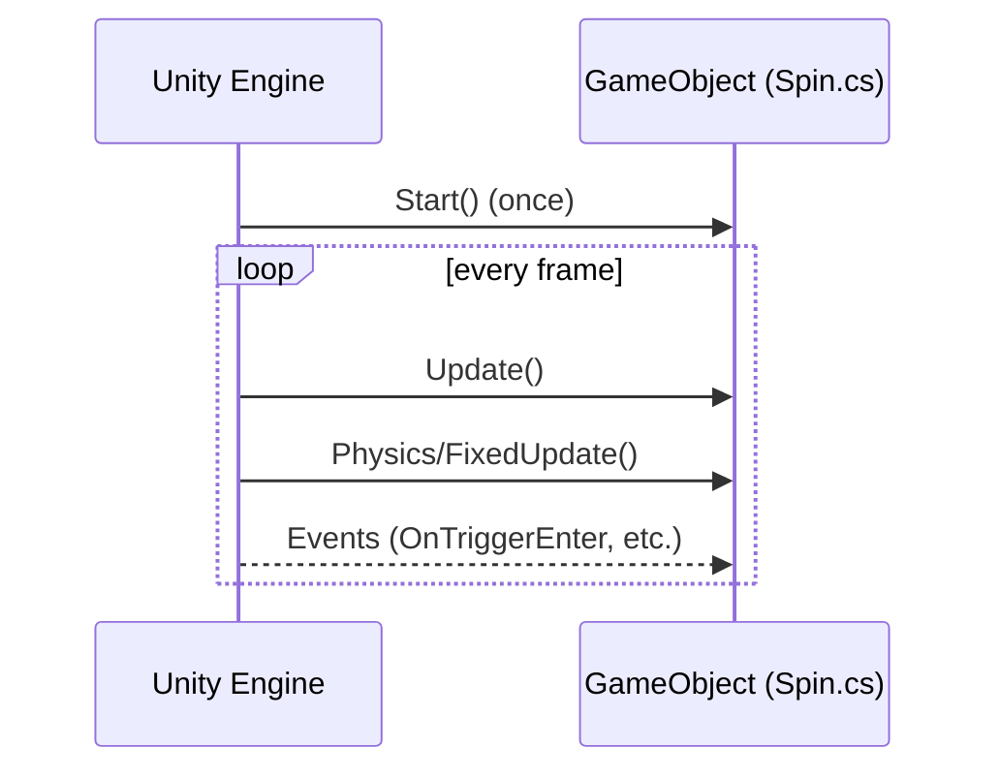

# Μικροmάθημα 1: Τα βασικά στοιχεία του Unity

## Στόχος Μάθησης
Να κατανοήσουμε την αρχιτεκτονική του Unity: Σκηνές, Αντικείμενα (GameObjects), και Συνιστώσες (Components).

---

## Εισαγωγή
Το Unity βασίζεται σε μια απλή αλλά ισχυρή ιδέα:

- Μια **Σκηνή** είναι σαν τη σκηνή ενός θεάτρου.
- Τα **GameObjects** είναι οι ηθοποιοί.
- Οι **Components** δίνουν μορφή και συμπεριφορά.

---

## Παράδειγμα
```csharp
using UnityEngine;

public class Spin : MonoBehaviour
{
    public float speed = 50f;

    void Update()
    {
        transform.Rotate(Vector3.up * speed * Time.deltaTime);
    }
}
```
hello

